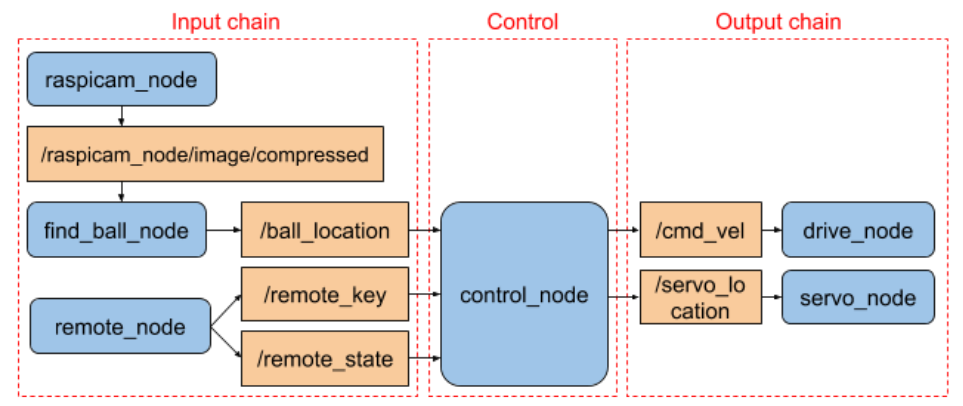

# Bachelor Thesis - Autonomous Robotics Platforms
The goal of this thesis was to provide learning tool for the University of Skövde to be able to teach robotics.  

## Tools 
- ROS (Robot Operative System). This framework is widely used for agile development of robotic platforms. You can check out more about ROS [here](https://www.ros.org/).
- Python. The robot was programmed using python given its widely flexibility and quick implementation.
- Gazebo. Simulation platform already implemented with ROS. This tool was used in order to test the concepts before implementing them in real life.
- Alphabot 2 Pi. Robot hardware used for the development. Is includes a Raspberry Pi 3 to run an image of ROS. You can check out the model [here](https://www.waveshare.com/wiki/AlphaBot2-Pi).

## Development
The duration of the project was of 6 months. The problem was fractioned into chains.
- Input chain: Receiving information from the sensors and processing the data. The processed data is then published into a ROS topic for the middle chain.
- Control: Once all the inputs have been processed into useful data the control node be in charge of making decisions. This is like the brain of the robot, it will generate the necessary outputs to take actions in the environment.
- Output chain: This chain receives interprets the data received from the control.

## Outcome

There are 3 main modes that we can set our robot to do:

- Manual mode. In this mode the robot is controlled via a remote controller.

- Ball following mode. In this mode the robot mantains a distance with the ball.

- Servo ball following mode. In this mode the robot will use the servo to keep the ball in sight.

## GitHub repository
The project is subdivided into:
- [Autonomous Robotics Real](https://github.com/nestoregon/alphabot2pi_real). Code for the real robot in a live environment.
- [Autonomous Robotics Simulation](https://github.com/nestoregon/alphabot2pi_simulation). Code for the robot simulation and its environment in Gazebo.

## Authors

* **Nestor Morales** - *Control Code and Gazebo Simulation* - [nestoregon](https://github.com/nestoregon)
* **Manuel Serrano** - *Control Code and Gazebo Simulation*
