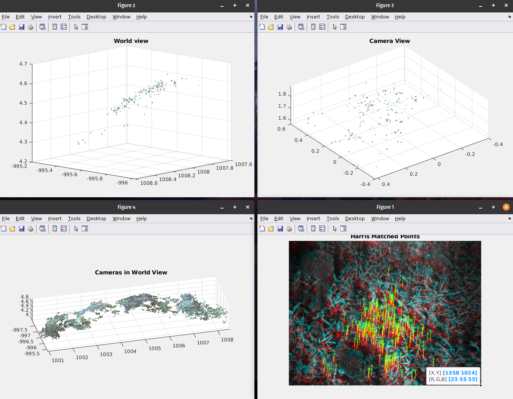

# Mapping of the Great Barrier Reef
Project for the Computer Vision course at the University of Sydney  
The goal was to map the barrier reef given a set of images and data belonging to 2 stereo vision cameras.

## Tools
- [MATLAB](https://www.mathworks.com/products/matlab.html) is a high-performance language for technical computing. It integrates computation, visualization, and programming in an easy-to-use environment where problems and solutions are expressed in familiar mathematical notation.
- [Computer Vision Toolbox](https://www.mathworks.com/products/computer-vision.html) provides algorithms, functions, and apps for designing and testing computer vision, 3D vision, and video processing systems.
- [Stero Vision Data](https://en.wikipedia.org/wiki/Computer_stereo_vision). In order to perform the mapping of the surface the students were provided a sample of the images captured by the camera.

## Development
It was developed under as part of the Computer Vision course. 
Data provided:
- /images_left/
- /images_right/
- camera_stereo_pose.mat
- stereo_calib.mat
- terrain.mat

We have the pair of images that correspond to the surface of the reef. The process be able to a surface having a pair of stereo vision cameras is as follows
- **Extract Features**. Using your preferred feature extraction method such as HARRIS or SURF extract the key features from each pair of images.
- **Match Points**. Use outlier detection to select the matching points. RANSAC is the algorithm user in order to know the inliers.
- **Triangulate 3D points**. Triangulate the position of the points knowing the intrinsic parameters of the stereo vision cameras.
- **Calculate translation between images**
- **Plot results** Plot the different results such as the map, WORLD VIEW and CAMERA VIEW.

## Outcome 

All Matlab Windows


Final map


## Download the PDF
[Asssignment PDF](../pdf/reef.pdf)

## Code
Send me an email to [nmoralesdfl@gmail.com](mailto:nmoralesdlf@gmail.com) to privately send you the files.  
Tested in MATLAB 2020b.
 
```matlab
% Nestor Morales
% USYD: 490566963
% Q1 - Assignment2
clear
clc
close all

% images location
images_left_dir = 'assignment2_stereodata/images_left/';
images_right_dir = 'assignment2_stereodata/images_right/';

% loading .m
load('assignment2_stereodata/terrain.mat');
load('assignment2_stereodata/camera_pose_data.mat');
load('assignment2_stereodata/stereo_calib.mat');

M = size(camera_poses.left_images,1);
p3 = [];
pRGB = [];
% M = 1; % uncomment to try a specific number of pairs.

% loop of 1.057125 s
for N = 1:M
    % load images - 0.058951 s
    im1 = char(camera_poses.left_images(N));    % im1 char
    im2 = char(camera_poses.right_images(N));   % im2 char

    im1 = imread([images_left_dir, im1]); % im1 png
    im2 = imread([images_right_dir, im2]);% im2 png
    im1_gray = rgb2gray(im1);
    im2_gray = im2;
    
    % SURF detectSURFFeatures/detectHarrisFeatures  0.214096s
    points1 = detectHarrisFeatures(im1_gray);
    points2 = detectHarrisFeatures(im2_gray);
    [d1, points1] = extractFeatures(im1_gray, points1);
    [d2, points2] = extractFeatures(im2_gray, points2);
    matched_pairs = matchFeatures(d1, d2);
    matchedPoints1 = points1(matched_pairs(:, 1), :);
    matchedPoints2 = points2(matched_pairs(:, 2), :);
    
    % undistort 0.768767 s
%     undistort1 = undistortPoints(matchedPoints1.Location, stereoParams.CameraParameters1);
%     undistort2 = undistortPoints(matchedPoints2.Location, stereoParams.CameraParameters2);
   
    % fundamental matrix 0.020851 s
%     [fRANSAC, inliners] =estimateFundamentalMatrix(undistort1,undistort2, ...
%         'Method', 'MSAC','NumTrials', 100,'DistanceThreshold', 1e-2);
    [fRANSAC, inliners] =estimateFundamentalMatrix(matchedPoints1.Location,matchedPoints2.Location, ...
        'Method', 'MSAC','NumTrials', 100);
    % new points - 0.000965 s
    points1 = matchedPoints1(inliners);
    points2 = matchedPoints2(inliners);
    pixels1 = uint32(points1.Location);

    % get 3D points - 0.005801
    point3D = triangulate(points1,points2,stereoParams);

    % store RGB value - 0.001146 s
    K = size(pixels1,1);
    pixelRGB = ones(K,3);
    for i = 1:K
        pixelRGB(i,:) = im1(pixels1(i,2), pixels1(i,1), :); % store pixels value
    end 
    pRGB = [pRGB; pixelRGB];

    % transform matrix - 0.001138 s
    R = camera_poses.R(:,:,N);
    t = camera_poses.t(:,N);
    extrinsic = [R,t];
    extrinsic(4,4) = 1;
    point3D_t = point3D;
    for i = 1:K
        point3D_t(i,:) = inv(R)*(point3D(i,:)'-t);
    end
    p3 = [p3; point3D_t];

end
% --------------------------------------------------------

% plot - 0.793261 s
figure; showMatchedFeatures(im1_gray,im2_gray,points1,points2); title('Harris Matched Points');
figure; scatter3(-point3D_t(:,1), point3D_t(:,2), point3D_t(:,3),6,pixelRGB/255,'filled'), view(-60,60); title('World view'); % make axis equal
figure; scatter3(-point3D(:,1), point3D(:,2), point3D(:,3),6,pixelRGB/255,'filled'), view(-60,60); title('Camera View');
figure; scatter3(-p3(:,1), p3(:,2), p3(:,3),6,pRGB/255,'filled'), title('Cameras in World View');% make axis equal
axis equal;
```