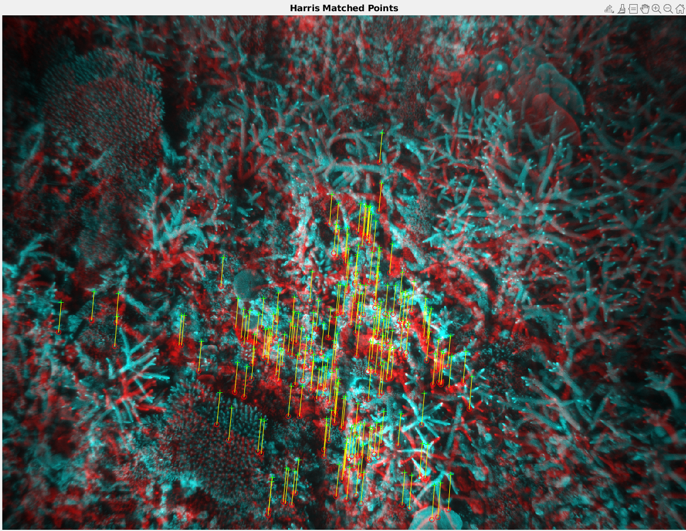
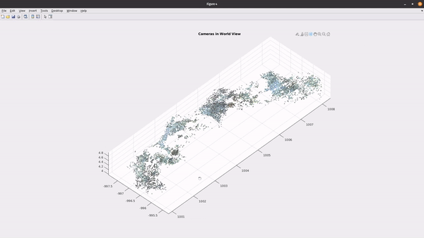

# Mapping of the Great Barrier Reef
Project for the Computer Vision course at the University of Sydney  
The goal was to map the barrier reef given a set of images and data belonging to 2 stereo vision cameras.

## Tools
- [MATLAB](https://www.mathworks.com/products/matlab.html) is a high-performance language for technical computing. It integrates computation, visualization, and programming in an easy-to-use environment where problems and solutions are expressed in familiar mathematical notation.
- [Stero Vision Data](https://en.wikipedia.org/wiki/Computer_stereo_vision). In order to perform the mapping of the surface the students were provided a sample of the images captured by the camera.

## Development
It was developed under as part of the Computer Vision course. 
Data provided:
- /images_left/
- /images_right/
- camera_stereo_pose.mat
- stereo_calib.mat
- terrain.mat

We have the pair of images that correspond to the surface of the reef. The process be able to a surface having a pair of stereo vision cameras is as follows
- **Extract Features**. Using your preferred feature extraction method such as HARRIS or SURF extract the key features from each pair of images.
- **Match Points**. Use outlier detection to select the matching points. RANSAC is the algorithm user in order to know the inliers.
- **Triangulate 3D points**. Triangulate the position of the points knowing the intrinsic parameters of the stereo vision cameras.
- **Calculate translation between images**
- **Plot results** Plot the different results such as the map, WORLD VIEW and CAMERA VIEW.

## Outcome
Harris matching points with RANDSAC for inlier detection

Final map

## Download the PDF

## Access to the code
Send me an email to nmoralesdfl@gmail.com to privately send you all the files.
 
