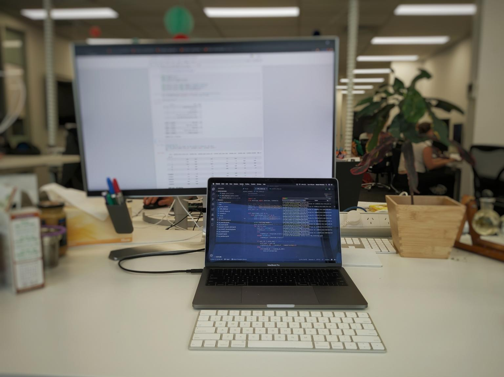

# Data Analyst - Grok Learning
[Grok Learning](www.groklearning.com) is a company based in Sydney that has an online platform to teach young people to code.  
The company had a lot of data from their different activities and wanted to get insight in their customers behavior. My role was tp analyze it.

## Tools
- [Tableau](https://www.tableau.com) is a data analysis platform with an user-friendly interface
- [Pandas](https://pandas.pydata.org/) is a fast, powerful, flexible and easy to use open source data analysis and manipulation tool, built on top of the Python programming language.
- [PostgreSQL](https://www.postgresql.org/) is a powerful, open source object-relational database system with over 30 years of active development that has earned it a strong reputation for reliability, feature robustness, and performance.

## Development
The first weeks I was in charge of learning [Tableau](https://www.tableau.com) and analyze the last major challenge Grok Learning provided: a coding competition for middle school. The results cannot be displayed given for company propoerty reasons.

The second week I worked with [Jupyter Notebooks](https://jupyter.org/) and [Pandas](https://pandas.pydata.org/) to cluster the students into groups depending regarding their performance in the challenge explained above. I used [PostgreSQL](https://www.postgresql.org/) to run queries for the specific data regarding student behaviour.

Work setup and environment:

<!--Last day of work:-->
<!---->

## Conclusions
I learned how to work with my supervisor in charge of sales while remaining independent doing the tasks. I learnt new skills such as SQL and Tableau and learn how to apply my previous skills such as ML and Python to the new demanded tasks. This has taught me that there is no peak in your skills, one must reflect on their current skills and learn how to adapt to the new conditions to find the best suitable solution to a current problem. That's what I value the most.

## Recommendation letter

[Grok Learning PDF](../pdf/recommendation_letter_groklearning.pdf)

