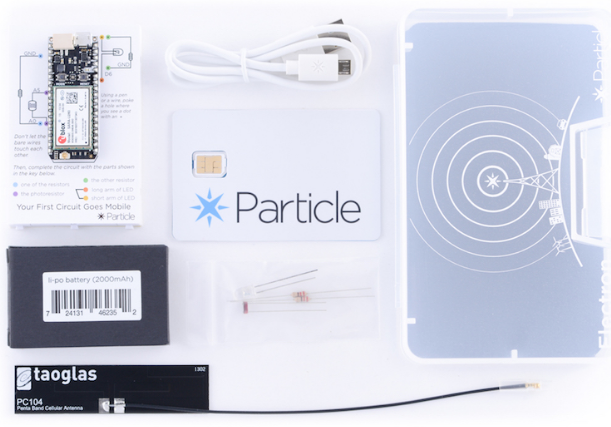

# Robotics Engineer - Hullbot
[Hullbot](www.hullbot.com) is a company based in Sydney that develops an underwater hull-cleaning robot.  
My role inside the company was to develop the IoT technologies to transfer valueable data from the robot.

## Tools
- [C++](https://www.cpp.com) programming language to deplot the IoT platform
- [Particle Electron](https://docs.particle.io/electron/) is an IoT board provided with a SIM card slot for IoT communications and access to internet.

## Development
There were two major tasks carried out:
- Selection of the IoT platform. There is a wide range of IoT platforms and devices, I did a thorough examination of the IoT market and decided, based on price, specifications and performance the most suitable one for the job.

- Developing the IoT code. This included the development of an algorithm for the robot that would provide information everyday. It would also control the deployment of the robot under water with a PID controller.

## Conclussions
The development was challenging given that it required to develop and apply something from scratch.

## Recommendation letter

